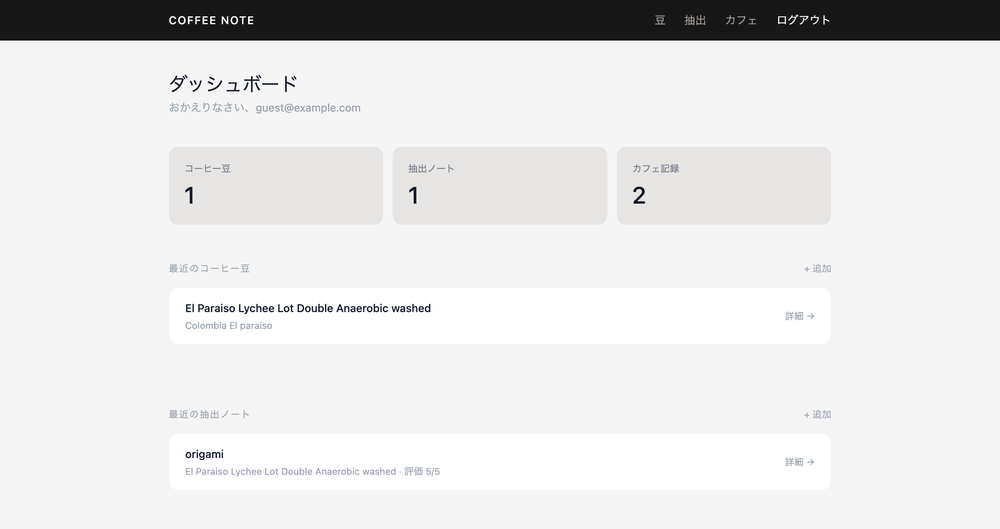
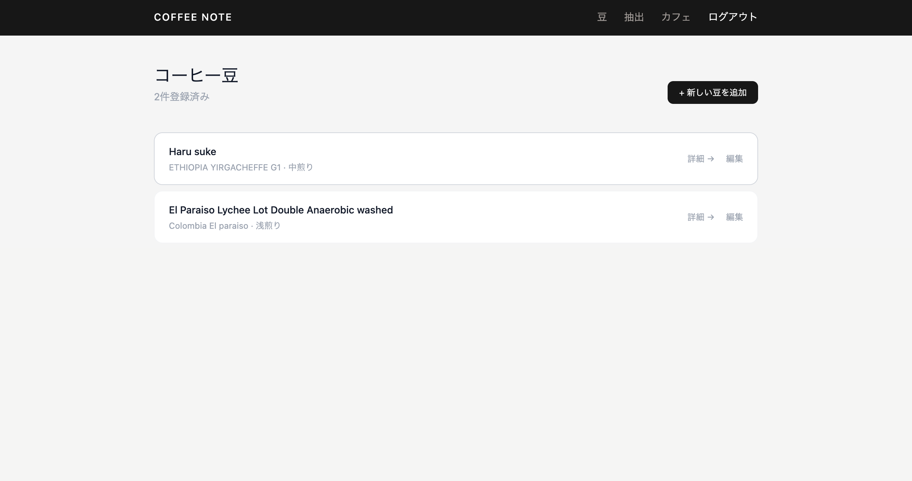
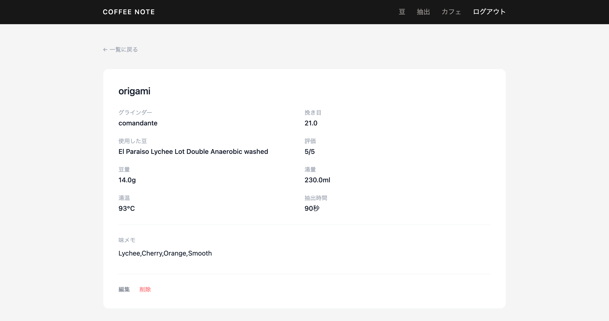
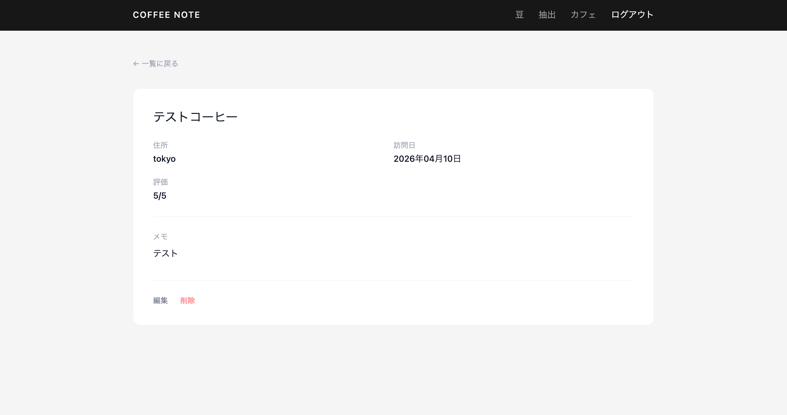

# Coffee Note ☕

コーヒーの記録を管理するWebアプリケーションです。

## 🔗 URL

https://coffee-note-taiyot-d42051292b47.herokuapp.com/

ゲストユーザーとしてログインボタンからすぐに試せます。

---

## 📸 スクリーンショット

### ダッシュボード


### コーヒー豆詳細（カッピングスコア）


### 抽出ノート


### カフェ記録


---

## 💡 アプリ概要

コーヒー好きのための記録アプリです。豆の情報・抽出レシピ・カフェ訪問記録を一元管理できます。

---

## 🚀 使い方

1. 新規登録またはゲストユーザーでログイン
2. コーヒー豆を登録（産地・品種・カッピングスコアなど）
3. 抽出ノートを記録（器具・レシピ・味メモなど）
4. カフェ記録を追加（店名・住所・評価など）

---

## 🛠 技術スタック

| 項目 | 技術 |
|------|------|
| フレームワーク | Ruby on Rails 7 |
| 認証 | Devise |
| CSS | Tailwind CSS |
| DB | PostgreSQL |
| デプロイ | Heroku |

---

## 🔧 主な機能

- ユーザー認証（新規登録・ログイン・ログアウト）
- ゲストログイン機能
- コーヒー豆の管理（CRUD）
- カッピングスコアのスライダー入力（Taste Intensity / Acidity / Mouthfeel）
- 抽出ノートの管理（CRUD）
- 器具の自由入力・グラインダー・挽き目の記録
- カフェ記録の管理（CRUD）
- バリデーション（未来の訪問日を弾くなど）

---

## 💭 開発した理由

コーヒーを趣味にしていて、豆ごとの味の違いや抽出レシピを記録したいと思ったのがきっかけです。既存のメモアプリでは管理しづらかったため、自分に必要な機能を自分で作ることにしました。

---

## ✨ 工夫した点

- **カッピングスコア**: SCAのカッピングフォームを参考にスライダーUIで直感的に入力できるようにした
- **器具の自由入力**: セレクトボックスと自由入力を切り替えられるようにし、あらゆる器具に対応
- **ゲストログイン**: ポートフォリオとして見てもらいやすいようにワンクリックでログインできる機能を実装
- **デザイン**: Tailwind CSSでスタイリッシュ・モダンなUIに統一

---

## 📊 ER図

```
User
├── has_many :coffee_beans
├── has_many :brew_notes
└── has_many :cafe_shops

CoffeeBean
├── belongs_to :user
└── has_many :brew_notes

BrewNote
├── belongs_to :user
└── belongs_to :coffee_bean (optional)

CafeShop
└── belongs_to :user
```

---

## ⚙️ ローカル環境での起動方法

```bash
git clone https://github.com/taiyot0918-collab/coffee_note.git
cd coffee_note
bundle install
rails db:create db:migrate db:seed
bin/dev
```
